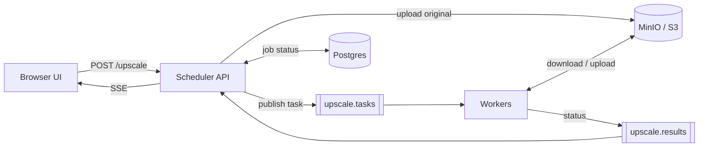

# System Design



| Component          | Responsibility                                                                 |
| ------------------ | ------------------------------------------------------------------------------ |
| Scheduler API (Go) | Uploads, publishes tasks, consumes results, SSE fan-out, presigned result URLs |
| Postgres           | Job status store                                                               |
| MinIO / S3         | Original images and upscaled results                                           |
| RabbitMQ           | Two durable queues: tasks in, results out                                      |
| Workers (Node.js)   | Consume tasks, download → upscale (FSRCNN) → upload, publish status            |

> [!NOTE]
> SSE fan-out is in-process (`scheduler/internal/upscale/hub.go`), so it only works with a single
> scheduler replica; move it to Redis pub/sub if the scheduler ever needs to scale out.
>
> There's also no idempotency lock or rate limiting yet. RabbitMQ's at-least-once delivery means a redelivered task just > re-runs, which is harmless today only because results overwrite the same deterministic key.

### API

| Endpoint                 | Description                                                                                 |
| ------------------------ | ------------------------------------------------------------------------------------------- |
| `POST /upscale`          | multipart `image` + `scale` → `{task_id}`                                                   |
| `GET /tasks/{id}/events` | SSE stream of status (sends current status immediately, then updates until `done`/`failed`) |
| `GET /tasks/{id}/result` | presigned URL for the upscaled image                                                        |

`POST /upscale`:

- Upload the original to S3 (`uploads/{id}.png`)
- Insert a job row in Postgres: `status = pending`
- Publish `{task_id, input_key, output_key, scale}` to `upscale.tasks`, return `{task_id}`

Worker (manual ack, `prefetch=1`):

- Publish `processing` to `upscale.results`
- Download, upscale with FSRCNN at the requested scale, upload to a **deterministic key** (`results/{task_id}.png`)
- On success: ack, publish `done`. On failure: reject (no requeue), publish `failed` — no retry, no DLQ yet

Scheduler consumes `upscale.results`, updates the Postgres job row, and fans the status out to any SSE subscribers via the in-memory hub. On SSE (re)connect, the handler first reads current status from Postgres so a client that connects after the event fired still gets the right state.

### Queue Topology

Two plain durable queues, no exchanges:

```txt
queue: upscale.tasks     — one message per task
queue: upscale.results   — status updates (processing / done / failed)
```

No priority, retry-, or yet. Messages aren't published with the or either, and a failed task's reject just drops it — there's no DLQ to catch it. Next things to build:

- **Priority**: split into two queues (paid / free) with weighted consumer counts instead of `x-max-priority`, so free jobs can't be starved under load. A single priority queue is simpler to declare but priority support on quorum queues is limited.
- **Retry (with backoff)**: Reject without requeue and let a TTL queue (`upscale.retry.30s`, dead-letter back to `upscale.tasks`) delay the redelivery. Track attempts via the `x-death` header; past a threshold, publish to a DLQ instead of retrying.
- **Dead-letter Queue**: Only transient errors (storage timeout, OOM) should retry, permanent ones (corrupt image, unsupported format) should go straight to the DLQ.
- **Persistent Delivery Mode**:
- **Publisher Confirms**:
- **Idempotency / rate limiting**: need a shared store for a per-task lock and per-session/IP counters. Deferred until it's actually needed — see the Redis note above.
- **Cleanup**: a bucket lifecycle rule (expire `uploads/`/`results/` after 24h) as the safety net, plus eager deletion of the original once the result is written.
